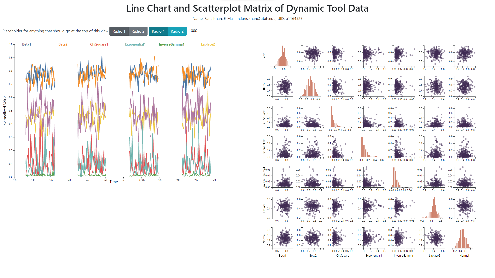

# Dynamic Data View

## Milestone Update
For the milestone, we've implemented the base skeleton code for our line chart and scatter plot matrix views of the dynamic data. Below is a screenshot of what this placeholder view looks like at the moment. `scratch.html` is the HTML file for this view (scratch work for the milestone update 😉).

In general, we've noticed that this view of the data is a bit laggy. The full dataset is tens of thousands of data points, which makes the line chart and especially the scatterplot matrix take long to initially render and update. Currently, the two views aren't synced together (that is, brushing the line chart doesn't update the scatterplot matrix like we plan to). We may use KDEs instead of histograms along the diagonal of the scatterplot matrix for our final submission. We plan to replace the scatterplots in the top-right triangle of the matrix with correlation coefficients. Currently, the user is able to select/deselect traces to be visible on the line chart, but we haven't yet implemented a way for the user to change the bounds of the time axis and filter the data that is shown on the line chart.